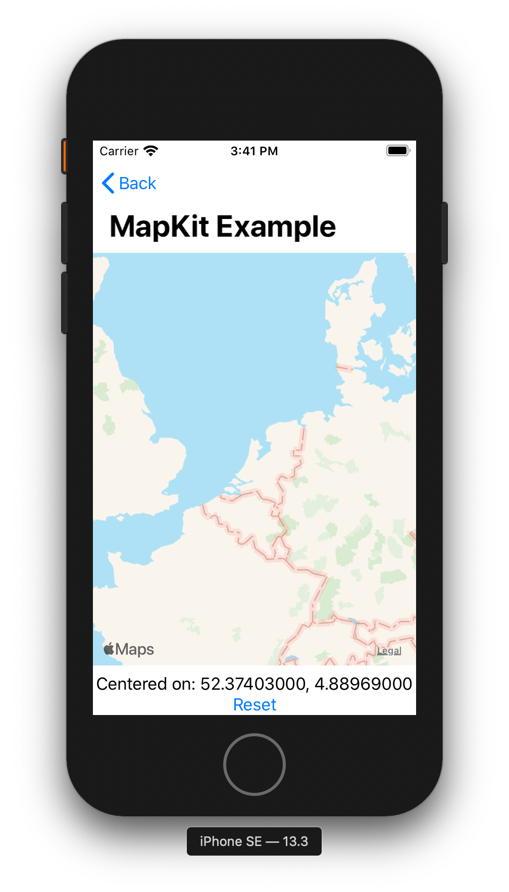

# UIViewRepresentableExamples
Examples of using UIKit stuff in SwiftUI.

The examples are not meant to be full-featured. Rather, they're small enough to
quickly understand, but still show enough code so that you can quickly add the
functions your project requires.

# Screenshots

